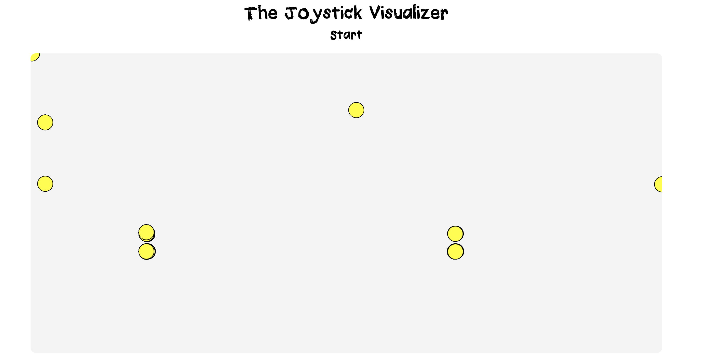

# The Joystick Visualizer
This project utilizes the TTGO T-Display with a joystick and button add on in order to create a joystick visualizer. This visualizer takes the serial output of the TTGO T-Display and paints dots on a digital canvas that can allow you to visualize the joystick's movement and its apparent noisiness. It also allows you to change the dot colors by pressing down on the joystick and clear your canvas by pressing the button.
This software portion for this project is built using p5.js.

## Set Up

### Uploading code onto your ESP32
For this project, you will need an ESP32 TTGO T-Display. I will be using the Arduino IDE in order to upload this project onto the ESP32. 

1. Clone this project and begin to set your Arduino IDE environment.
2. To set up the Arduino IDE environment, follow the instructions in the demo [here](https://www.youtube.com/watch?v=adLUgmCJKnM).
- Some issues that came up for me in setting up this environment included lack of dependencies (e.g. python) and the upload speed. For example, I found that I had to lower my upload speed to 115200. Keep these in mind and make changes accordingly if you come across any issues when following the demo -- the output should let you know.
3. In the esp32-serial directory located in this repo, you will find the Arduino code to load onto your ESP32. Open this code up in the Arduino IDE.
3. This project uses joystick and button connections. Make sure that your connections match up with pin numbers you see in the code. xyzPins refer to the joystick pins and is utilized in line 4 and the pinMode() function in line 5 references the pin for the button.
3. Connect to your ESP32. Make sure that you select your board on the top left. 
4. Upload your code and voilà! If you open up your serial monitor in the Arduino IDE, you should now see the serial output values from the joystick and button.

### Opening up The Joystick Visualizer (the media generation program)

1. Now that you have already cloned the repo, open up index.html on a webpage.
2. Press start. You should be prompted to select your ESP32 device. Make sure that you have closed the serial monitor on the Arduino IDE if this is still open or running.
3. You should now see circles on your canvas. This means that your joystick is working. Feel free to move the joystick around to draw around on the canvas/visualize your joystick movement.

## Technical Decisions
My initial idea for this media generation program was to create a fun drawing canvas that users could use. Since I only had the joystick and button to work with, this limited the project complexity; I figured that this drawing canvas may work similarly to something like an Etch A Sketch. 

What I found after building a basic prototype of this was that, moving the joystick with not give me all the values within that range to produce a smooth, drawing curve. Upon moving the joystick up, for example, the y-value read will jump from 0 to 4095 as opposed to give me all the values within 0-4095 to plot on the screen. On top of this, the joystick was incredibly noisy in the sense that, even when I was not moving the joystick, the x and y values would continue to fluctuate. This rendered the drawing aspect to my initial idea difficult. 

I realized that, while this project would not work as a drawing tool, it could still work as a visualizer of sorts as it is reading in the joystick values and plotting them on a digital canvas. 

The canvas and drawing is achieved using p5.js.

## Notes
For more details on this project, visit the blog post [here](https://pitch-koala-3bc.notion.site/The-Joystick-Visualizer-4eddff551a73464f988ddf9c684bc269).
